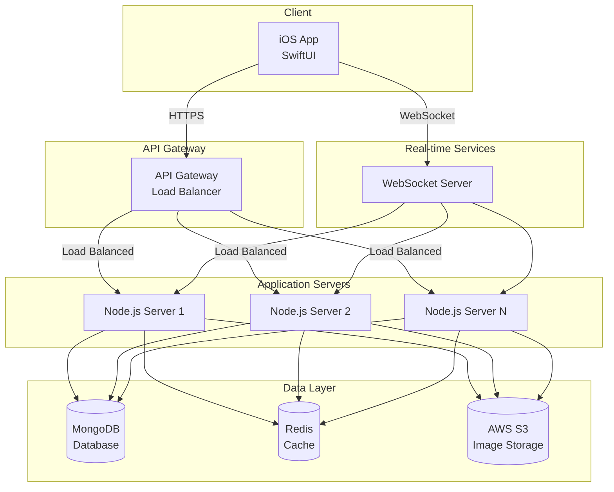
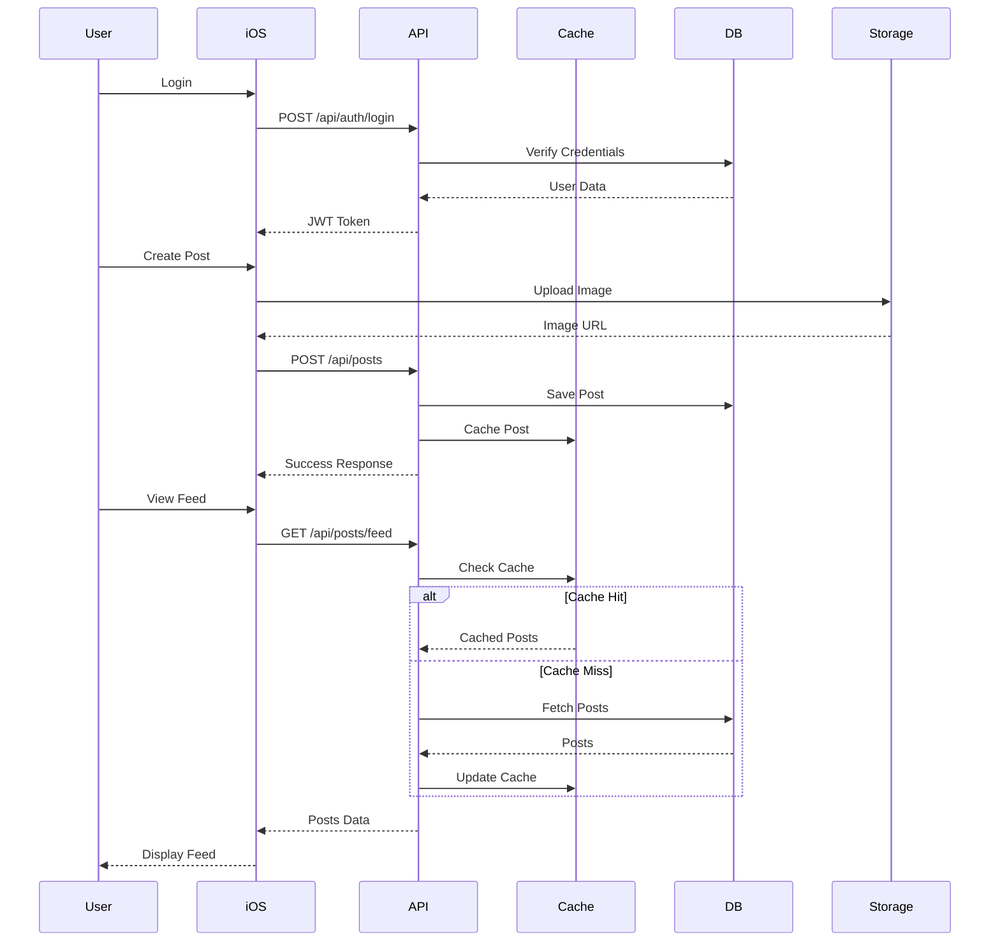
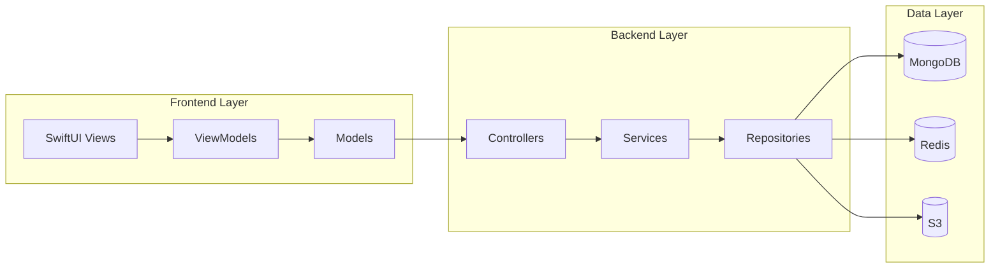
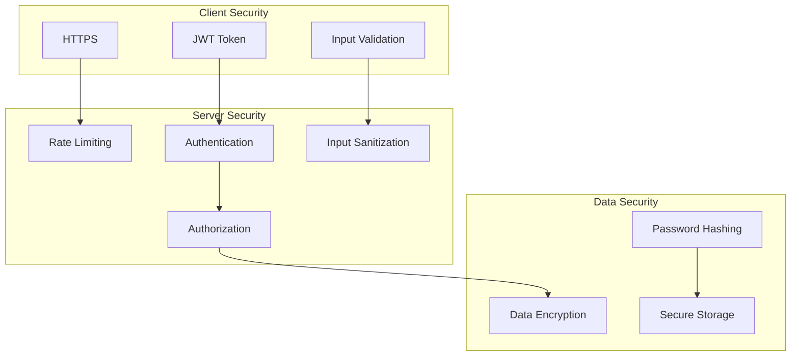

# Mock Instagram - System Architecture Diagram

## High-Level Architecture

```mermaid
graph TB
    subgraph Client
        iOS[iOS App<br/>SwiftUI]
    end

    subgraph "API Gateway"
        Gateway[API Gateway<br/>Load Balancer]
    end

    subgraph "Application Servers"
        Server1[Node.js Server 1]
        Server2[Node.js Server 2]
        ServerN[Node.js Server N]
    end

    subgraph "Data Layer"
        MongoDB[(MongoDB<br/>Database)]
        Redis[(Redis<br/>Cache)]
        S3[(AWS S3<br/>Image Storage)]
    end

    subgraph "Real-time Services"
        WebSocket[WebSocket Server]
    end

    iOS -->|HTTPS| Gateway
    Gateway -->|Load Balanced| Server1
    Gateway -->|Load Balanced| Server2
    Gateway -->|Load Balanced| ServerN
    
    Server1 --> MongoDB
    Server2 --> MongoDB
    ServerN --> MongoDB
    
    Server1 --> Redis
    Server2 --> Redis
    ServerN --> Redis
    
    Server1 --> S3
    Server2 --> S3
    ServerN --> S3
    
    iOS -->|WebSocket| WebSocket
    WebSocket --> Server1
    WebSocket --> Server2
    WebSocket --> ServerN
```

## Data Flow Diagram

```mermaid
sequenceDiagram
    participant User
    participant iOS
    participant API
    participant Cache
    participant DB
    participant Storage

    %% Authentication Flow
    User->>iOS: Login
    iOS->>API: POST /api/auth/login
    API->>DB: Verify Credentials
    DB-->>API: User Data
    API-->>iOS: JWT Token

    %% Post Creation Flow
    User->>iOS: Create Post
    iOS->>Storage: Upload Image
    Storage-->>iOS: Image URL
    iOS->>API: POST /api/posts
    API->>DB: Save Post
    API->>Cache: Cache Post
    API-->>iOS: Success Response

    %% Feed Loading Flow
    User->>iOS: View Feed
    iOS->>API: GET /api/posts/feed
    API->>Cache: Check Cache
    alt Cache Hit
        Cache-->>API: Cached Posts
    else Cache Miss
        API->>DB: Fetch Posts
        DB-->>API: Posts
        API->>Cache: Update Cache
    end
    API-->>iOS: Posts Data
    iOS-->>User: Display Feed
```

## Component Interaction

```mermaid
graph LR
    subgraph "Frontend Layer"
        Views[SwiftUI Views]
        ViewModels[ViewModels]
        Models[Models]
    end

    subgraph "Backend Layer"
        Controllers[Controllers]
        Services[Services]
        Repositories[Repositories]
    end

    subgraph "Data Layer"
        MongoDB[(MongoDB)]
        Redis[(Redis)]
        S3[(S3)]
    end

    Views --> ViewModels
    ViewModels --> Models
    Models --> Controllers
    Controllers --> Services
    Services --> Repositories
    Repositories --> MongoDB
    Repositories --> Redis
    Repositories --> S3
```

## Security Architecture

```mermaid
graph TB
    subgraph "Client Security"
        HTTPS[HTTPS]
        JWT[JWT Token]
        InputValidation[Input Validation]
    end

    subgraph "Server Security"
        RateLimit[Rate Limiting]
        Auth[Authentication]
        Authz[Authorization]
        Sanitization[Input Sanitization]
    end

    subgraph "Data Security"
        Encryption[Data Encryption]
        Hashing[Password Hashing]
        SecureStorage[Secure Storage]
    end

    HTTPS --> RateLimit
    JWT --> Auth
    InputValidation --> Sanitization
    Auth --> Authz
    Authz --> Encryption
    Hashing --> SecureStorage
``` 